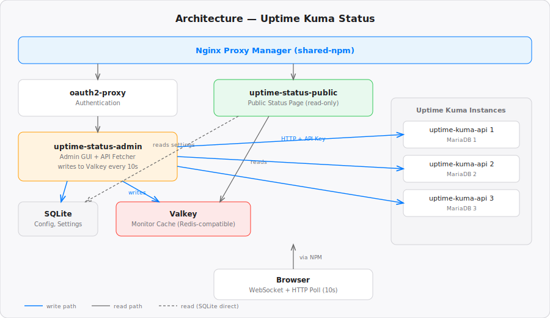

# Uptime Kuma Status

Compact status page for multiple [Uptime Kuma](https://github.com/louislam/uptime-kuma) instances. Displays hundreds of monitors across instances in a dense, Apple System Status-style layout — because Uptime Kuma's built-in status pages waste too much space.

[](LICENSE)
[](https://www.python.org/)
[](https://fastapi.tiangolo.com/)
[](Dockerfile)
[](https://github.com/louislam/uptime-kuma)
[](CHANGELOG.md)
[](CONTRIBUTING.md)

## Features

- **Compact Layout** — Apple-inspired design with masonry grid, colored status dots, monitor hierarchy
- **Multi-Instance** — Aggregate monitors from multiple Uptime Kuma instances
- **Real-Time Updates** — WebSocket + 10s HTTP polling, Valkey-backed shared cache
- **Admin GUI** — Manage instances, hide/show monitors, incidents, footer, settings (behind oauth2-proxy)
- **Bilingual** — German / English, switchable on both pages
- **Theme** — Light / Dark / Auto with live OS preference detection
- **Incidents** — Severity levels, end time with auto-resolve (30 min grace period), updates timeline with severity changes, drag & drop sorting
- **Smart Outage List** — Groups fail as "degraded" when partially down, redundant/duplicate monitor names are collapsible with `+` indicator and hover tooltip
- **Optional Public SSO** — Put the public page behind oauth2-proxy as well, logged-in user and logout button shown automatically
- **Fullscreen / Wall Display Mode** — Real F11 fullscreen triggers scaled-up layout (1080p / 2K / 4K tiers) for distance readability
- **Monitor Search** — Client-side instant filter for large monitor lists in the admin
- **No Direct DB Access** — Uses [uptime-kuma-api](https://github.com/wvogel/uptime-kuma-api) sidecar proxy for secure read-only access

## Architecture



- **Admin app** fetches from uptime-kuma-apis every 10s, writes to Valkey + manages SQLite config
- **Public app** reads from Valkey (monitors) + SQLite (settings, incidents, footer) — no writes
- **SQLite** stores configuration: instances, hidden monitors, incidents, settings, footer items
- **Valkey** stores the live monitor/heartbeat data as shared cache

## Quick Start

### 1. Deploy uptime-kuma-api sidecars

Add [uptime-kuma-api](https://github.com/wvogel/uptime-kuma-api) to each Uptime Kuma instance's `docker-compose.yml`. The admin GUI generates the snippet with API key when you add an instance.

### 2. Deploy uptime-status

```bash
git clone https://github.com/wvogel/uptime-kuma-status.git
cd uptime-kuma-status
cp .env.example .env
cp oauth2-proxy.env.example oauth2-proxy.env
# Edit both .env files
docker compose up -d
```

### 3. Configure

- Open the admin page (behind oauth2-proxy)
- Add Uptime Kuma instances (name + uptime-kuma-api URL)
- Copy the generated docker-compose snippet to each Kuma instance
- Configure footer, incidents, logos, and settings

## Docker Compose Services

| Service | Purpose | Port | Network |
|---------|---------|------|---------|
| `uptime-status-admin` | Admin UI + API fetcher | 80 | default |
| `uptime-status-public` | Public status page | 80 | default + shared-npm |
| `uptime-status-oauth2-proxy` | Auth proxy for admin | 80 | default + shared-npm |
| `valkey` | Shared cache (Redis-compatible) | 6379 | default |

## Environment Variables

### .env

| Variable | Default | Description |
|----------|---------|-------------|
| `SECRET_KEY` | *required* | Fernet key for API key encryption |
| `DATABASE_PATH` | `data/uptime-status.db` | SQLite database path |
| `CACHE_INTERVAL` | `10` | Fetch interval in seconds |

Generate a secret key:
```bash
python3 -c "import base64,os;print(base64.urlsafe_b64encode(os.urandom(32)).decode())"
```

### oauth2-proxy.env

See `oauth2-proxy.env.example` for OIDC configuration. Uses Valkey for session storage.

## Screenshots

### Status Page (Light)
Compact masonry grid with colored status dots. Monitor groups from Uptime Kuma hierarchy. Incidents and affected services at top.

### Status Page (Dark)
Full dark mode support with automatic theme detection.

### Admin — Instances
Sortable instance list with connection status and docker-compose snippet generation.

### Admin — Monitors
Tree view with hierarchy, toggle visibility per monitor, sidebar navigation by instance.

### Admin — Incidents
Draggable incident list with severity levels, bilingual titles, and datetime.

## Tech Stack

- **Backend**: Python, FastAPI, SQLAlchemy, httpx
- **Frontend**: Vanilla JS, Jinja2 templates, CSS custom properties
- **Cache**: Valkey (Redis-compatible)
- **Auth**: oauth2-proxy (OIDC)
- **Database**: SQLite (config), Valkey (monitor cache)
- **API Proxy**: [uptime-kuma-api](https://github.com/wvogel/uptime-kuma-api)

## License

MIT
